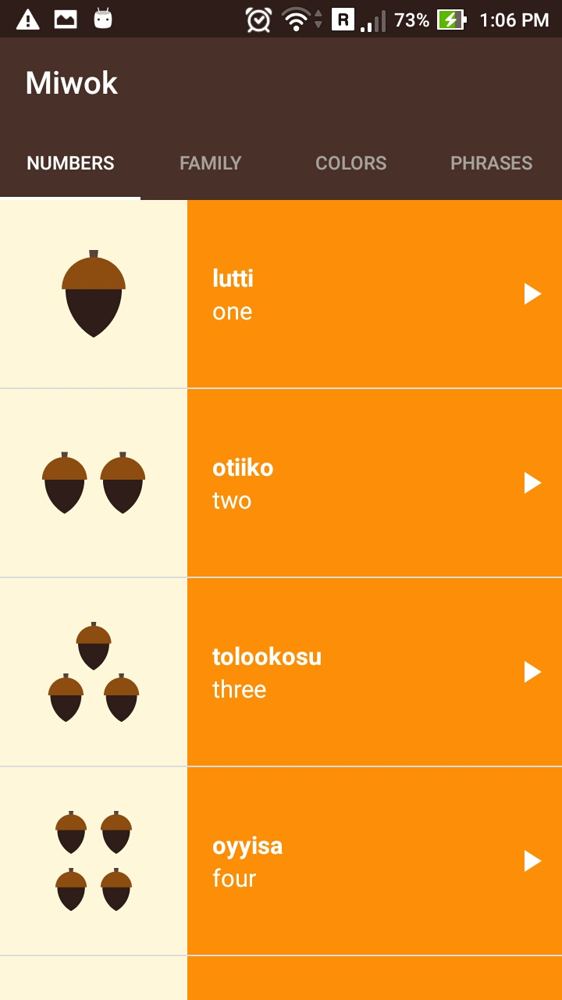
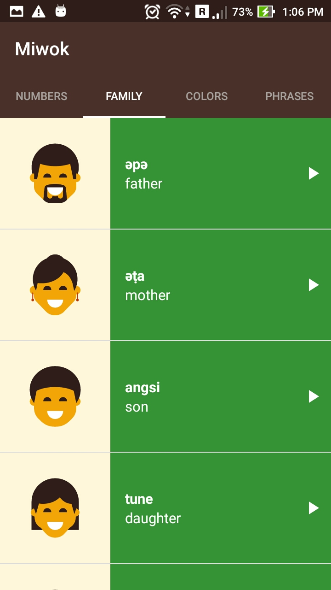
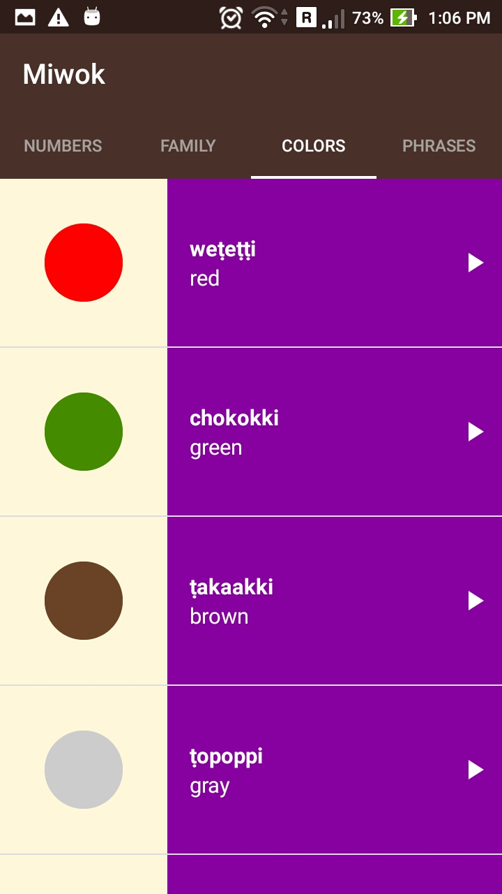
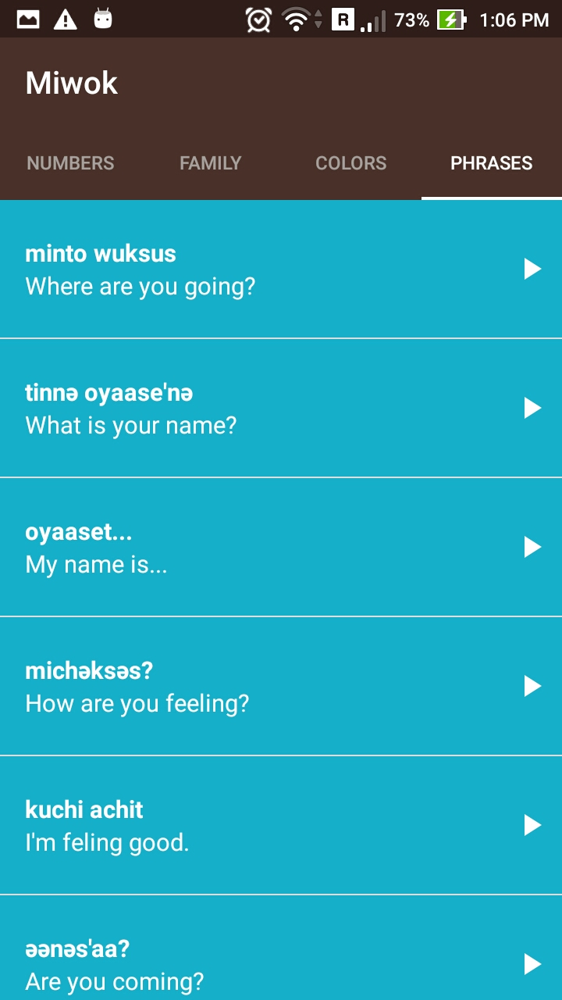

Miwok App  
===================================

This app displays a list of words and phrases which will help user to learn some common used words in ancient Miwok Tribe.

You can learn how to pronounce numbers, family members name, colors and some common phrases by listening to the audio samples in the app.

<b>Components Used</b>: Fragments, ViewPager, TabLayout, ListView, Custom ArrayAdapter, AudioManager & MediaPlayer classes.

Screenshots
------------
 &nbsp;&nbsp;&nbsp;&nbsp;    
 &nbsp;&nbsp;&nbsp;&nbsp;

Video Demo
---------------
https://www.youtube.com/watch?v=Iia1RolffRw

Thanks to the course videos and audio samples provided by Udacity under Udacity Android Basics Nanodegree course.

